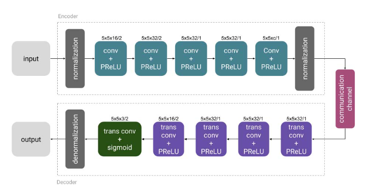
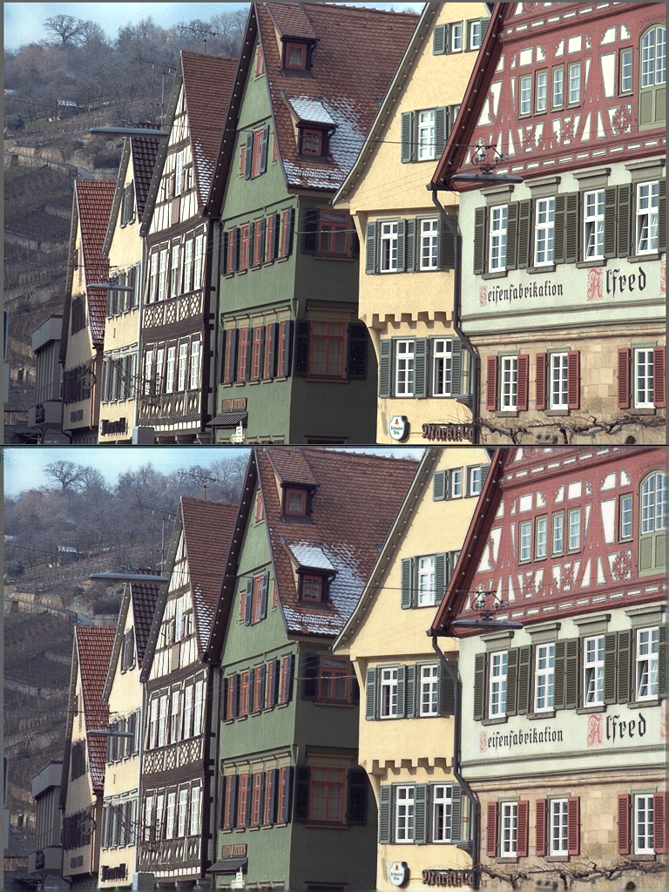
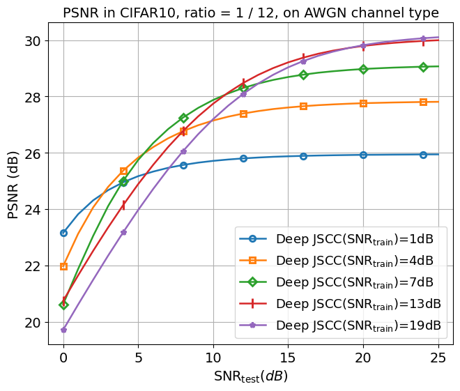
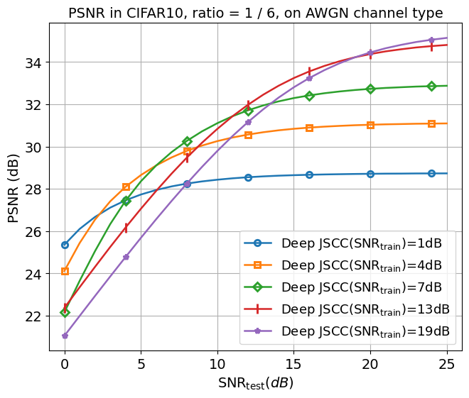
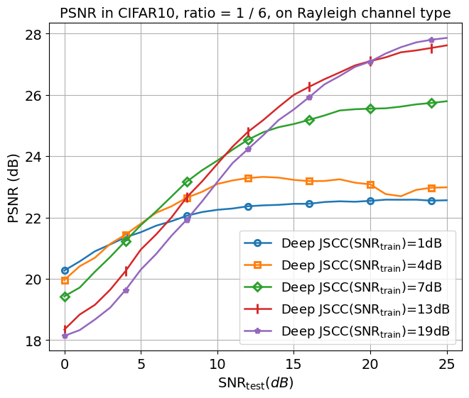
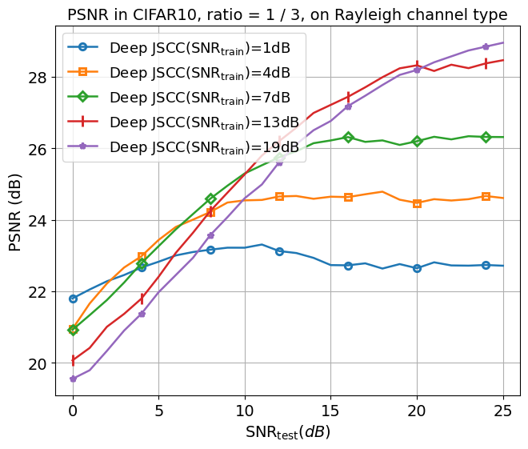

# Deep JSCC
This implements training of Deep JSCC models for wireless image transmission as described in the paper [Deep Joint Source-Channel Coding for Wireless Image Transmission](https://ieeexplore.ieee.org/abstract/document/8723589) by Pytorch. And there has been a [Tensorflow and keras implementations ](https://github.com/irdanish11/DJSCC-for-Wireless-Image-Transmission).

This is my first time to use PyTorch and git to reproduce a paper, so there may be some mistakes. If you find any, please let me know. Thanks!


## Update-2024.06.04
- modify the `train.py` to omit most of the args in command line, you can just use `python train.py --dataset ${dataset_name}` to train the model.
- add tensorboard to record the results in exp.
- add the `visualization/` file to visualize the result.
- add bash file to run the code in parallel.


## Architecture

<div style="text-align: center;">
    
</div>

## Demo


The model trained on cifar10 which is 32\*32 but test on kodim which is 768\*512 (top); and the model trained on imagenet which is resized to 128\*128 but test on kodim which is 768\*512 (bottom).
<div style="display: flex;">
  
  <div style="width: 5px;"></div> 
  
</div>


## Installation
conda or other virtual environment is recommended.

```
git clone https://github.com/chunbaobao/Deep-JSCC-PyTorch.git
cd ./Deep-JSCC-PyTorch
pip install requirements.txt
```

## Usage
### Prepare Dataset
The cifar10 dataset can be downloaded automatically by torchvision. But the imagenet dataset should be downloaded manually from [ImageNet website](https://image-net.org/) and put in the right place, refer to [dataset.py](https://github.com/chunbaobao/Deep-JSCC-PyTorch/blob/main/dataset.py#L28). And run:
```
python dataset.py 
```

### Training
The training command used to be very long, but now you can just use `python train.py --dataset ${dataset_name} --channel ${channel}` to train the model. 
The default dataset is cifar10.
The parmeters can be modified in the `train.py` file. The default parameters are similar to the paper.


| Parameters                   | CIFAR-10         | ImageNet         |
|------------------------|------------------|------------------|
| `batch_size`           | 64               | 32               |
| `init_lr`              | 1e-3             | 1e-4             |
| `weight_decay`         | 5e-4             | 5e-4             |
| `snr_list`             | [19, 13, 7, 4, 1]| [19, 13, 7, 4, 1]|
| `ratio_list`           | [1/6, 1/12]      | [1/6, 1/12]      |
| `if_scheduler`         | True             | False            |
| `step_size`            | 640              | N/A              |
| `gamma`                | 0.1              | 0.1              |


<!-- ALSO! The batch_size for cifar10 training in the paper is small causing the GPU utilization is low. So The bash script is provided to run the code in parallel for different snr and ratio for cifar10 dataset. (Example of two GPUs)
```
bash parallel_train_cifar.sh --channel ${channel}
``` -->


### Evaluation
The `eval.py` provides the evaluation of the trained model. 

You may need modify slightly to evaluate the model for different snr_list and channel type in `main` function. 
```
python eval.py
```
All training and evaluation results are saved in the `./out` directory by default. The `./out` directory may contain the structure as follows:
```
./out
├── checkpoint # trained models
│   ├── $DATASETNAME_$INNERCHANNEL_$SNR_$RATIO_$CHANNEL_TYPE_$TIMES_on_$DATE
│       ├── epoch_$num.pth
│       ├── ...
│   ├── CIFAR10_10_1.0_0.08_AWGN_13h21m37s_on_Jun_02_2024
│   ├── CIFAR10_20_7.0_0.17_Rayleigh_14h03m19s_on_Jun_03_2024
│   ├── ...
├── configs # training configurations
│   ├── $DATASETNAME_$INNERCHANNEL_$SNR_$RATIO_$CHANNEL_TYPE_$TIMES_on_$DATE
│   ├── $CIFAR10_10_4.0_0.08_AWGN_13h21m38s_on_Jun_02_2024.yaml
│   ├── ...
├── logs # training logs
│   ├── $DATASETNAME_$INNERCHANNEL_$SNR_$RATIO_$CHANNEL_TYPE_$TIMES_on_$DATE
│       ├── tensorboard logs
│   ├── ...
├── eval # evaluation results
│   ├── $DATASETNAME_$INNERCHANNEL_$SNR_$RATIO_$CHANNEL_TYPE_$TIMES_on_$DATE
│       ├── tensorboard logs
│   ├── ...
```
### Visualization

The `./visualization` directory contains the scripts for visualization of the training and evaluation results.

- `single_visualization.ipynb` is used to get demo of the model on single image like the demo above.
- `plot_visualization.ipynb` is used to get visualizations of the perfprmance of the model on different snr and ratio.

## Results


 
<div style="display: flex;">
  
  <div style="width: 0px;"></div> <!-- 为了让两个图像之间有一点间距 -->
  
</div>

<div style="display: flex;">
  
  <div style="width: 0px;"></div> <!-- 为了让两个图像之间有一点间距 -->
  
</div>


### TO-DO
- ~~Add visualization of the model~~
- ~~plot the results with different snr and ratio~~
- ~~add Rayleigh channel~~
- train on imagenet
- **Convert the real communication system to a complex communication system**

## Citation
If you find (part of) this code useful for your research, please consider citing
```
@misc{chunhang_Deep-JSCC,
  author = {chunhang},
  title = {a pytorch implementation of Deep JSCC},
  url ={https://github.com/chunbaobao/Deep-JSCC-PyTorch},
  year = {2023}
}

