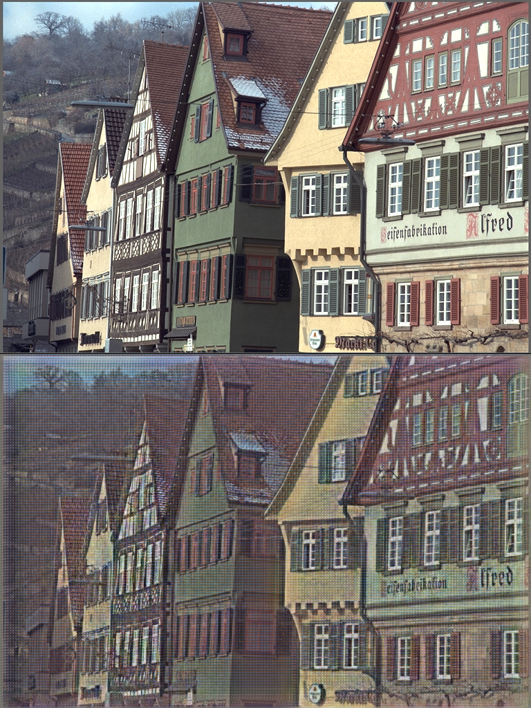

# Deep JSCC
This implements training of deep JSCC models for wireless image transmission as described in the paper [Deep Joint Source-Channel Coding for Wireless Image Transmission](https://ieeexplore.ieee.org/abstract/document/8723589) by Pytorch. And there has been a [Tensorflow and keras implementations ](https://github.com/irdanish11/DJSCC-for-Wireless-Image-Transmission).

This is my first time to use PyTorch and git to reproduce a paper, so there may be some mistakes. If you find any, please let me know. Thanks!
## Architecture


## Demo

the model trained on cifar10 which is 32\*32 but test on kodim which is 768\*512.


the model trained on imagenet which is resized to 128\*128 but test on kodim which is 768\*512.


## Installation
conda or other virtual environment is recommended.

```
git clone https://github.com/chunbaobao/Deep-JSCC-PyTorch.git
cd ./Deep-JSCC-PyTorch
pip install requirements.txt
```

## Usage
### Prepare Dataset
The cifar10 dataset can be downloaded automatically by torchvision. But the imagenet dataset should be downloaded manually from [ImageNet website](https://image-net.org/) and put in the right place, refer to [dataset.py](https://github.com/chunbaobao/Deep-JSCC-PyTorch/blob/main/dataset.py#L28). And run:
```
python dataset.py 
```

### Training Model
Run(example presented in paper) on cifar10

```
python train.py --lr 1e-3 --epochs 1000 --batch_size 64 --channel 'AWGN' --saved ./saved --snr_list 1 4 7 13 19 --ratio_list 1/6 1/12 --dataset cifar10 --num_workers 4 --parallel True --if_scheduler True --scheduler_step_size 50
```
or Run(example presented in paper) on imagenet

```
python train.py --lr 10e-4 --epochs 300 --batch_size 32 --channel 'AWGN' --saved ./saved --dataset imagenet --num_workers 4 --parallel True
```
### Evaluation
Run(example presented in paper)
```
python eval.py --channel 'AWGN' --saved ./saved/${mode_path} --snr 20 --test_img ${test_img_path}
```
### TO-DO
- Add visualization of the model
- plot the results with different snr and ratio

## Citation
If you find (part of) this code useful for your research, please consider citing
```
@misc{chunhang_Deep-JSCC,
  author = {chunhang},
  title = {a pytorch implementation of Deep JSCC},
  url ={https://github.com/chunbaobao/Deep-JSCC-PyTorch},
  year = {2023}
}

